# avalon-erp

## 介绍

odoo java版 前后分离快速开发平台，基于开源技术栈精心打造，融合Vue3+SpringBoot。 适配数据库mysql,postgres 支持标准的RAID权限功能，

## 社区


## 开发环境准备

## 1、安装docker

下载网址：https://www.docker.com/

## 2、安装redis

```shell
# 1. 拉取 Redis 7.0.4 镜像
docker pull redis:7.0.4
# 2. 启动 Redis 容器
docker run -d --name redis-7.0.4 -p 6379:6379 redis:7.0.4
```

## 3、安装Nacos配置中心

```shell
# 1. 拉取 Nacos 最新版本镜像
docker pull nacos/nacos-server
#  2. 启动 Nacos 容器
docker run -d --name nacos -p 8848:8848 -e MODE=standalone nacos/nacos-server
```

## 4、安装postgres数据库

```shell
# 1. 拉取 PostgreSQL 镜像
docker pull postgres
# 2. 启动 PostgreSQL 容器
docker run -d --name postgres-container -p 5432:5432 \
-e POSTGRES_USER=postgres \
-e POSTGRES_PASSWORD=postgres \
-e POSTGRES_DB=postgres \
postgres
```

## 5、连接到postgres容器并创建avalon账户

```sql
docker exec -it postgres-container psql -U postgres
CREATE ROLE avalon WITH LOGIN CREATEDB PASSWORD 'avalon';
# 验证角色创建
\du
```

## 6、本地环境安装jdk15+

教程：https://docs.pingcode.com/baike/2874339

## 7、使用IDEA打开avalon-java项目

### 7.1、在avalon-core目录下配置数据库

username改为avalon，password改为avalon

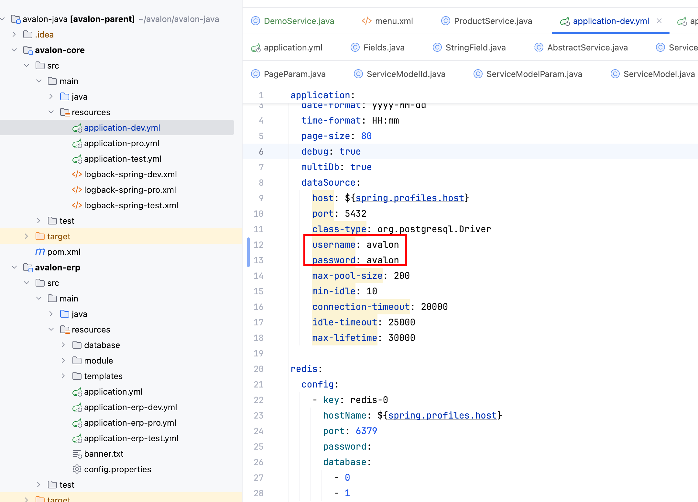

### 7.2、在avalon-core目录下配置redis

一般情况下不用修改

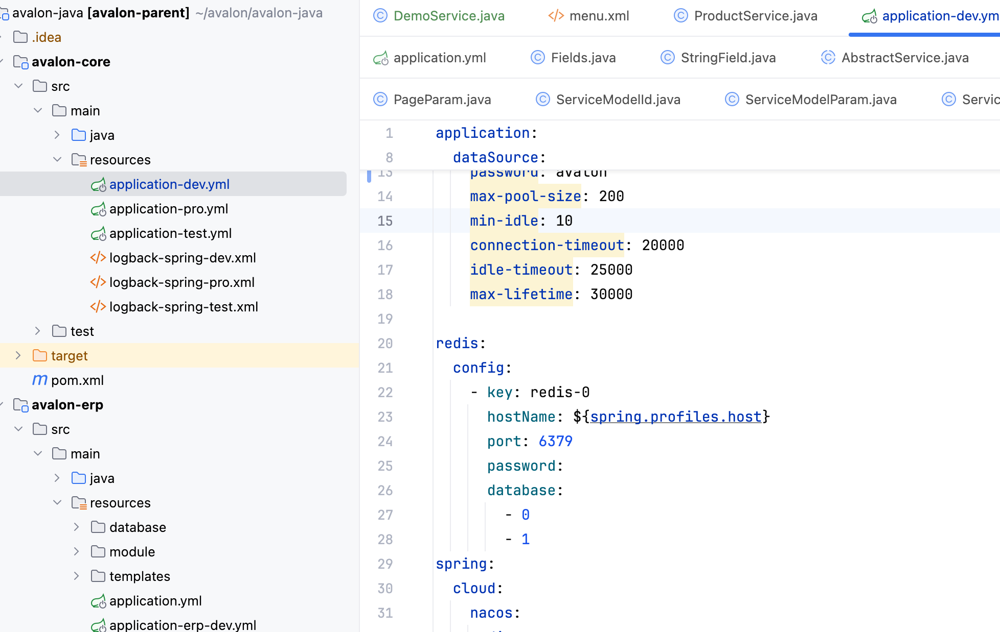

### 7.3、在avalon-erp目录下配置nacos

找到对应的application.yml文件，修改nacos对应的username与password，默认情况下不用修改，如果有修改avalon-file与avalon-im项目相同的文件，进行一样的调整

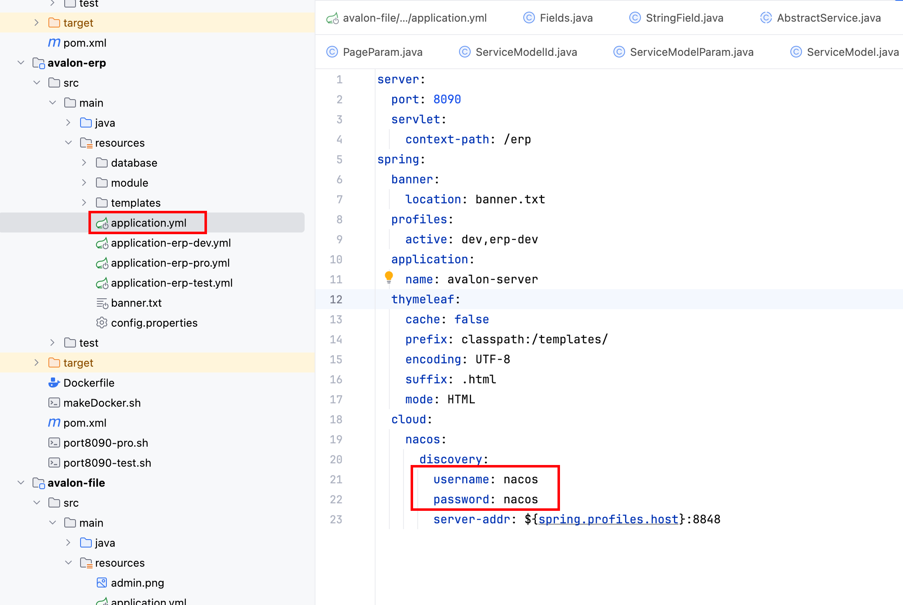


## 8、启动avalon-erp项目

启动时需要增加如下参数,否则会报java.lang.reflect.InaccessibleObjectException: Unable to make protected final java.lang.Class java.lang.ClassLoader.defineClass(java.lang.String,byte[],int,int) throws java.lang.ClassFormatError accessible: 错误

```shell
--add-opens java.base/java.lang=ALL-UNNAMED
```

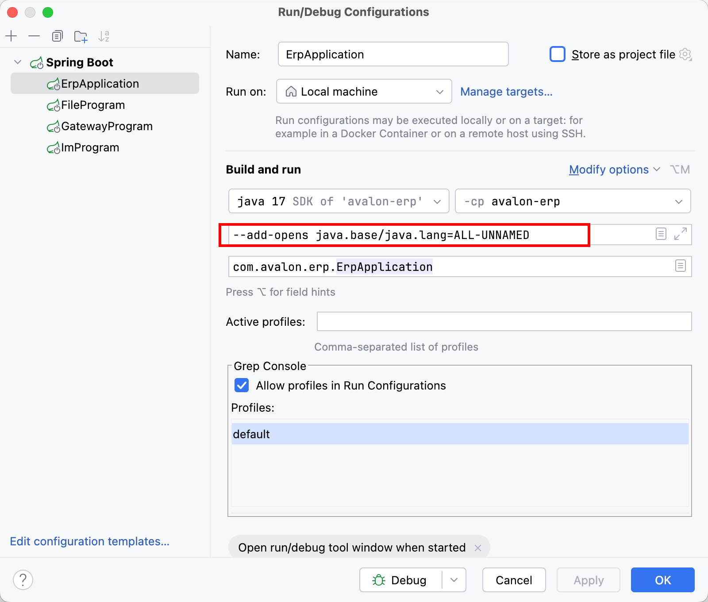


## 恭喜你成功运行avalon-erp项目，之后一次运行其他项目


# 运行Avalon-admin项目

## 1、安装node 20+版本

安装方法：https://blog.csdn.net/qq_37523550/article/details/136183405

## 2、使用WebStorm打开avalon-admin

执行yarn install 安装依赖

## 3、 使用yarn dev 运行软件

登录界面如下

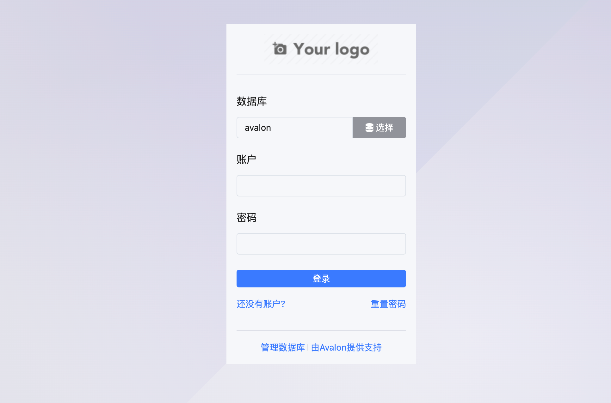

### 4 、使用webStrom进行调试

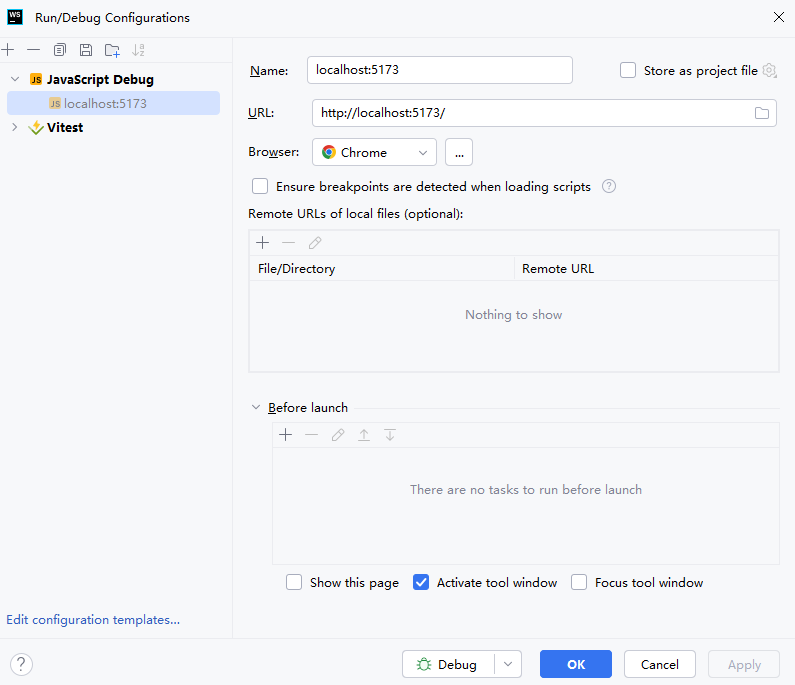

# 架构

前端分离

后端采用微服务架构，

模块高内聚，低耦合方式，可继承的开发方式，大大提高开发效率，

支持mysql/postgres多数据库开发连接

目录结构图

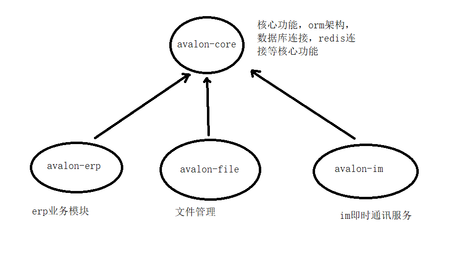

# 模块目录

以base模块为例

```
base(模块名)
│   BaseModule.java(模块类)
│
└───controller(http接口)
│   │   BaseController.java
│   
└───resource(资源文件，含菜单，视图，图片，默认数据)
|   │   record (默认数据)
|	│   |	base.group.xml(base.group模型默认数据)
|	|	view (视图与菜单)
|	|	|	menu.xml (菜单)
|	|	|	base.service.views.xml (base.service模型视图)
|    
|	service(模型)
|	|	userService.java (用户模型)
|	|
```


# 案例模块

在这里可以学会如何在avalon上创建一个属于自己的模块,此模块功能有房租出租功能

## 创建house模块

在avalon-erp/src/main/java/com/avalon/erp/addon包下创建house包

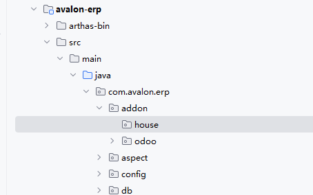

## 创建HouseModule模块类

在house包下创建HouseModule.java类，并且继承AbstractModule类

```java
package com.avalon.erp.addon.house;

import com.avalon.core.module.AbstractModule;
import lombok.extern.slf4j.Slf4j;
import org.springframework.stereotype.Component;

/**
 * @author lwlianghehe@gmail.com
 * @date 2025/04/08 11:24
 */
@Component
@Slf4j
public class HouseModule extends AbstractModule {
    @Override
    public String getModuleName() { // 模块标识 唯一值
        return "house";
    }

    @Override
    public String getLabel() { // 显示标题
        return "租房";
    }

    @Override
    public String getDescription() { // 描述
        return "租房,看房等功能";
    }

    @Override
    public Boolean getDisplay() { // 安装后，显示在左边栏位上
        return true;
    }
}

```

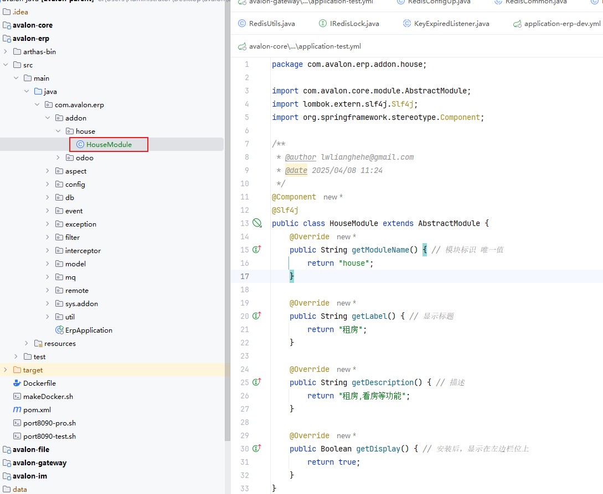

## 创建HouseService模型

在house包下，创建service包，以及在service包下创建HouseService类，并且继承AbstractService类.

模型自带id,name,createTime,creator,updateTime,updater字段

```java
package com.avalon.erp.addon.house.service;

import com.avalon.core.service.AbstractService;
import lombok.extern.slf4j.Slf4j;
import org.springframework.stereotype.Service;

/**
 * @author lwlianghehe@gmail.com
 * @date 2025/04/08 11:29
 */
@Service
@Slf4j
public class HouseService extends AbstractService {
    @Override
    public String getServiceName() { // 模型名，等价于表名，第一个house表示模块名
        return "house.house";
    }

    @Override
    public String getLabel() {
        return "房屋";// 标题
    }
}
```

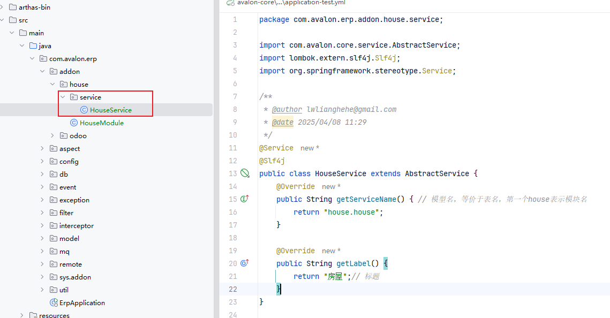

## 创建视图资源包

在house包下，创建resource/view包

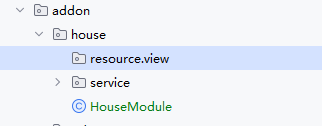

## 创建HouseService视图文件

在resource/view下创建house.house.views.xml视图文件

在视图文件中，需要生成窗口，tree视图,form视图

```xml
<?xml version="1.0" encoding="UTF-8" ?>
<avalon>
    <!--house form 视图-->
    <record id="house_house_view_form" service="base.action.view">
        <field name="name">house form</field>
        <field name="label">房屋</field>
        <field name="viewMode">form</field>
        <field name="ref_serviceId">house.house</field>
        <field name="arch" type="xml">
            <form>
                <sheet>
                    <row>
                        <col>
                            <field name="name"/>
                        </col>
                    </row>
                </sheet>
            </form>
        </field>
    </record>

    <!--house tree 列表视图-->
    <record id="house_house_tree" service="base.action.view">
        <field name="name">house list</field>
        <field name="label">房屋</field>
        <field name="viewMode">tree</field>
        <field name="ref_serviceId">house.house</field>
        <field name="arch" type="xml">
            <tree>
                <field name="name"/>
            </tree>
        </field>
    </record>

    <!--house窗口-->
    <record id="house_house_action" service="base.action.window">
        <field name="name">house</field>
        <field name="label">房屋信息</field>
        <field name="viewMode">tree</field>
        <field name="ref_serviceId">house.house</field>
    </record>
</avalon>
```

## 创建菜单

在resource/view下创建menu.xml菜单文件

```xml
<?xml version="1.0" encoding="UTF-8" ?>
<avalon>
    <menuitem id="menu_house_house_action" name="房屋" action="house_house_action"/>
</avalon>
```

## 将视图，菜单文件与模块类进行绑定

资源文件需要与模块类进行绑定，否则无法生效

```java
package com.avalon.erp.addon.house;

import com.avalon.core.module.AbstractModule;
import lombok.extern.slf4j.Slf4j;
import org.springframework.stereotype.Component;

/**
 * @author lwlianghehe@gmail.com
 * @date 2025/04/08 11:24
 */
@Component
@Slf4j
public class HouseModule extends AbstractModule {
    @Override
    public String getModuleName() { // 模块标识 唯一值
        return "house";
    }

    @Override
    public String getLabel() { // 显示标题
        return "租房";
    }

    @Override
    public String getDescription() { // 描述
        return "租房,看房等功能";
    }

    @Override
    public Boolean getDisplay() { // 安装后，显示在左边栏位上
        return true;
    }

    // 菜单文件在最后
    @Override
    public String[] getResource() {
        return new String[]{
                "resource/view/house.house.views.xml",
                "resource/view/menu.xml",
        };
    }
}

```

## 启动avalon-erp，avalon-file,avalon-admin项目

使用IDEA，webstorm启动项目

## 使用前端创建demo数据库

项目启动后，在登录页面，点击 管理数据库 按钮

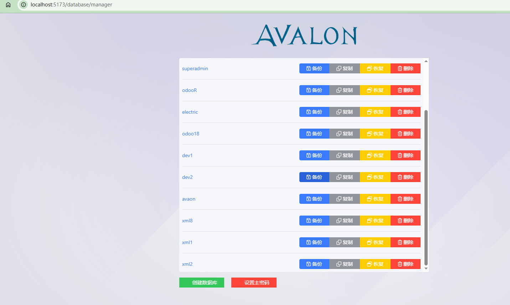

点击创建数据库按钮，输入demo，点击确认，等待一段时间，数据库会自动创建完毕

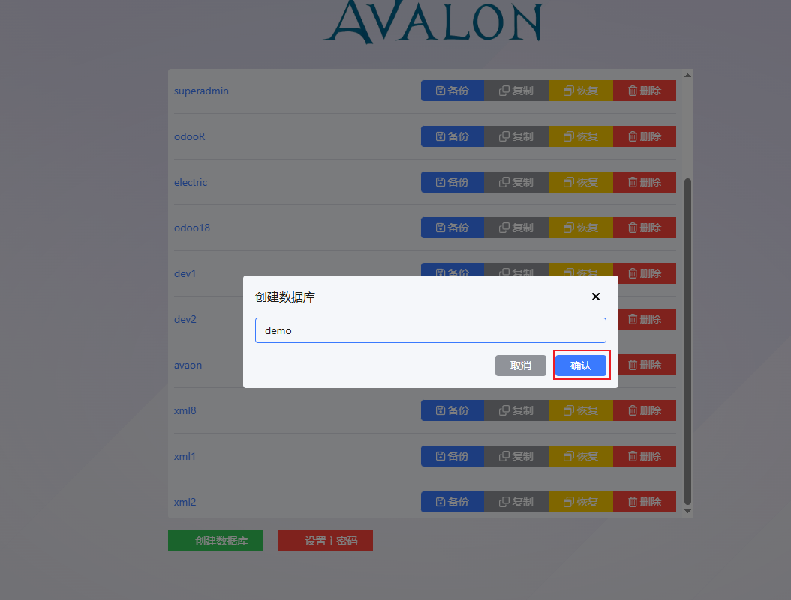

## 登录系统

数据库创建之后，点击数据库名字，会跳转到登录页面，

默认管理员账户admin,密码是123456

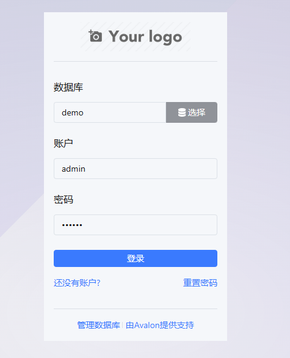

## 刷新模块

如果模块没有显示，则点击App菜单下的更新模块菜单，进行刷新模块，刷新后按F5刷新当前页面

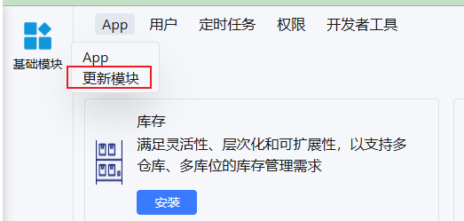

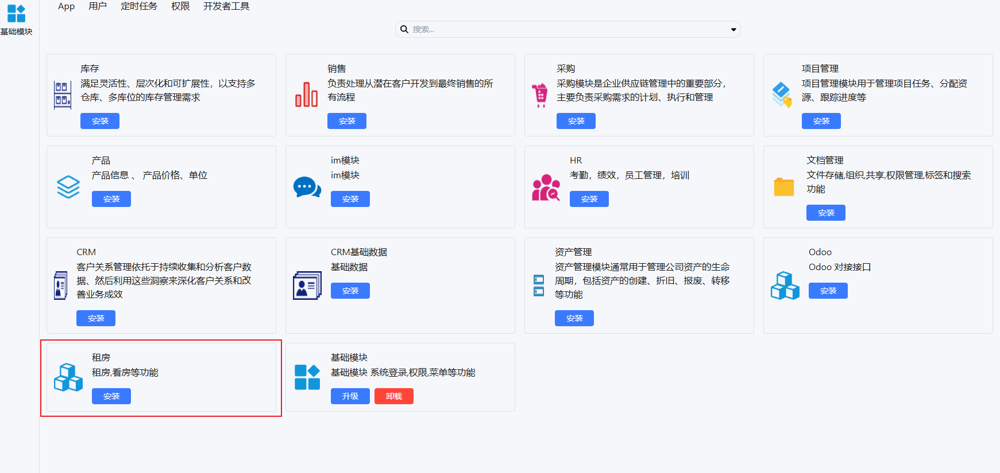

## 安装租房模块

点击安装即可

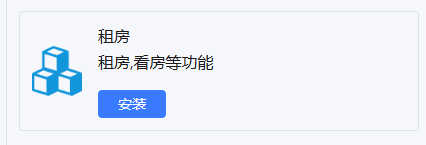

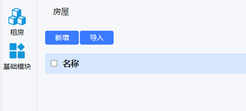

恭喜已经完成house模块的开发


# 支持的字段

1. 基本字段

```java
BigDecimal,
BigInteger,
Boolean,
Date,
DateTime,
Double,
Float,
Html,
Image,
Integer,
Selection(Enum),
String,
Text,
Time,
Password
```

2. 关联字段

```java
One2one, 1对1
One2many, 1对多
Many2one,多对1
Many2many 多对多
```

## Field字段属性

### 公用属性

```java
public interface IField {
    //返回数据类型对应的数据库类型字段
    Integer getSqlType();

    // 获取字段所在模型
    AbstractService getService();

    // 唯一值
    Boolean isUnique();//是否是唯一的值

    /**
     * 唯一
     *
     * @param isUnique 唯一
     */
    void setIsUnique(Boolean isUnique);

    // 允许为null
    Boolean allowNull();//是否允许为空

    /**
     * 设置可以为空值
     *
     * @param allowNull 空值
     */
    void setAllowNull(Boolean allowNull);

    // 字段名称，即属性名，也是数据库字段名 使用驼峰
    String getName();

    //数据库名称
    String getFieldName();

    // 主键
    Boolean isPrimaryKey();

    // 自增
    Boolean isAutoIncrement();

    //默认值
    IFieldDefaultValue getDefaultValue();

    void setDefaultValue(IFieldDefaultValue defaultValue);

    // 必填
    Boolean isRequired();

    void setIsRequired(Boolean isRequired);

    // 只读
    Boolean isReadonly();

    Type getFieldType();

    Object getSqlValue(Object value);

    Object getClientValue(Object value); // 得到前端显示的值

    String getClassType();
}
```

### Integer字段

```java
  public Integer getMax() // 最大值
  public Integer getMin() //最小值
```

### String字段

```java
 public Integer getMaxLength() // 最大长度
 public Integer getMinLength() // 最小长度
```


# ORM API

## Module类

```java
	//模块名
    public abstract String getModuleName();

	//模块名称
    public abstract String getLabel();

	//描述
    public abstract String getDescription();

    /// 安装之后，是否显示在菜单中
    public abstract Boolean getDisplay();

	// 依赖模块，安装本模块之前，先安装依赖模块
    public String[] depends() 

    /**
     * 自动安装,true，则depends的模块已安装，则自动安装当前模块,未完成
     *
     * @return
     */
    public Boolean autoInstall()


    /**
     * 模块安装之后，运行js
     *
     * @return js路径
     */
    public String[] getStartJS()

	// 前端web依赖的vue组件,实验阶段
    public String[] getVue() 

    /**
     * 模块图标
     *
     * @return url 本地文件
     */
    public String getIcon()
        
    /**
     * 创建模块
     */
    public void createModule() 
   
     // 获取模块的所有模型类
    public AbstractServiceList getServiceList() 
    
    // 根据模块名获取模块主键
    public Integer getModuleId(String moduleName) 
        
    // 删除模块
    public void dropModule() 
    
    // 升级模块
    public void upgradeModule()
```

## AbstractService模型类

### 查询接口

```java
    /**
     * 查询主键集合
     *
     * @param condition
     * @return
     * @throws AvalonException
     */
    Record search(Condition condition) throws AvalonException;

    /**
     * 统计个数
     *
     * @param condition
     * @return
     * @throws AvalonException
     */
    Integer selectCount(Condition condition) throws AvalonException;

	// 查询满足条件的记录
    Record select(Condition condition, String... fields) throws AvalonException;
	// 查询满足条件的记录
    Record select(String order, Condition condition, String... fields) throws AvalonException;
	// 查询满足条件的记录
    Record select(Integer limit, String order, Condition condition, String... fields) throws AvalonException;
	// 查询满足条件的记录 分页
    PageInfo selectPage(PageParam pageParam,
                        String order,
                        Condition condition,
                        String... fields) throws AvalonException;

    //获取字段值 从数据库获取
    FieldValue getFieldValue(String fieldName, Condition condition);
```

### 创建接口

```java
// 创建默认记录
RecordRow create(RecordRow defaultRow) throws AvalonException;
```

#### 新增接口

```java
PrimaryKey insert(RecordRow recordRow) throws AvalonException;//插入记录 会检查当前记录 及联插入
List<Object> insertMulti(Record record) throws AvalonException;//批量插入记录 会检查当前记录 及联插入
```

### 更新接口

```java
Integer update(RecordRow recordRow, Condition condition) throws AvalonException;//更新记录 直接更新

Integer update(RecordRow recordRow) throws AvalonException;//更新记录 检查满足更新条件 及联更新

Integer updateMulti(Record record) throws AvalonException;//批量更新
```

#### 删除接口

```java
Integer delete(Object id) throws AvalonException;//删除指定主键记录 不会检查是否满足删除条件， 直接删除

Integer delete(Condition condition, String serviceName) throws AvalonException;//条件删除 会检查记录是否存在

Integer delete(RecordRow row) throws AvalonException;//删除记录 会检查当前记录 及联删除
```

#### 调用服务接口

```java
// 调用服务方法
Object invokeMethod(String service, String methodName, Object... args) 
```

#### 数据库接口

```java
 	/**
     * 创建数据库表
     */
    public void createTable() 
    /*
     删除数据库表
     */
    public void dropTable()
    /*
     数据库表是否存在
     */
    public Boolean existTable() 
    /*
    数据库字段是否存在
     */
    public Boolean existField(Field field)
    /*
    删除数据库字段
     */
    public void dropField(String fieldName)
    
    /**
     * 升级数据表结构
     */
    public void upgradeTable()
```

## TransientService模型

用于记录临时记录，不会生成数据库结构

主要用于，用于定制Form视图

```java
//进行文档显示
@Service
@Slf4j
public class DocumentViewService extends TransientService {
    @Override
    public String getServiceName() {
        return "document.show.transient";
    }

    @Override
    public String getLabel() {
        return "文档显示";
    }

    public Field documents = Fields.createOne2many("文档", "document.file", "ownerId"); //当前用户文档

    @Override
    public RecordRow create(RecordRow defaultRow) throws AvalonException {
        AbstractService documentService = getContext().getServiceBean("document.file");
        Condition condition = Condition.equalCondition("ownerId", getContext().getUserId())
                .andEqualCondition("active", false)
                .andEqualCondition("parentId", null); // 默认获取第一层文件与文件夹
        Record select = documentService.select(condition,
                "id", "name", "isFolder", "url", "size", "mine", "ownerId");
        defaultRow.put(documents, select);
        return super.create(defaultRow);
    }

    // 上传文件,前端跳转路由
    public RecordRow uploadFile() {
        RecordRow row = RecordRow.build();
        row.put("type", "ir.actions.client")
                .put("tag", "uploadDocument");
        return row;
    }
}
```


## 继承

继承分为委托继承、扩展继承，原型继承

### 委托继承

委托继承：是一种通过为模型添加外键（`Many2one` 字段）指向另一个模型来实现的继承方式。

1. **模型独立性**：委托继承的子模型不会直接继承父模型的字段和方法，而是通过外键（`Many2one`）字段关联到父模型。
2. **不修改父模型**：父模型保持独立，子模型通过外键引用父模型来获得其字段和方法。
3. **数据分离**：父模型和子模型的数据分别存储在各自的数据库表中，通过外键关联。
4. **适用场景**：当你需要逻辑上关联两个模型，但不希望直接修改或扩展父模型时，可以使用委托继承。

相关接口

```java
    /**
     * 委托继承
     * 格式 serviceName: field
     *
     * @return 继承模型
     */
    DelegateInheritMap getDelegateInherit();

    /**
     * 获取委托继承字段
     *
     * @return 字段列表
     */
    FieldList getDelegateInheritFields();
	/**
     * 获取委托模型下的所有字段
     * @param delegateServiceName 委托继承模型
     * @return 字段
     */
    FieldList getDelegateInheritFields(String delegateServiceName);

    /**
     * 判断是否是委托字段
     *
     * @param fieldName 字段名
     * @return 是 否
     */
    boolean isDelegateInheritField(String fieldName);
```

用例

```java
@Slf4j
@Service
public class StaffService extends AbstractService {
    @Override
    public String getServiceName() {
        return "hr.staff";
    }
	
     /**
     * 委托继承
     * 格式 serviceName: field
     *
     * @return 继承模型
     */
    @Override
    public DelegateInheritMap getDelegateInherit() {
        DelegateInheritMap delegateInheritMap = new DelegateInheritMap();
        delegateInheritMap.put("crm.partner", "partnerId");
        return delegateInheritMap;
    }

    @Override
    public String getLabel() {
        return "员工";
    }

    public final Field partnerId = Fields.createMany2one("联系人", "crm.partner"); // 此字段为委托继承，可以通过当前模型，进行同步修改
    public final Field code = Fields.createString("员工编码");
    public final Field jobId = Fields.createMany2one("岗位", "hr.job");
    public final Field orgId = Fields.createMany2one("组织", "hr.org");
    public final Field userId = Fields.createMany2one("账号", "base.user");
}
```

### 扩展继承

扩展继承 允许你向现有模型添加字段、方法或重写现有方法，而无需直接修改原始模型代码。

**扩展继承的特点**
不修改原始模型：通过 getInherit接口 扩展现有模型，而不是修改其定义。
添加新字段：可以向现有模型添加自定义字段。
重写方法：可以通过基类调用原始方法并添加自定义逻辑。
适用范围广：适用于 avalon 的所有模型

接口

```java
	/**
     * 继承模式 getServiceName == getInherit 则是扩展，否则是继承
     *
     * @return 继承模型
     */
    String getInherit(); // 只能单继承 因为java是单继承，无法实现多继承

    /**
     * 继承字段
     *
     * @return 继承字段
     */
    List<Field> getInheritFields();
```

案例

```java
@Service
@Slf4j
public class HrUserService extends AbstractService {
    @Override
    public String getServiceName() {
        return "base.user"; // 必须和getInherit 保持一致
    }

    @Override
    public Boolean getNeedDefaultField() {
        return false;
    }

    @Override
    public String getInherit() {
        return "base.user";
    }

    public Field staffId = Fields.createMany2one("员工", "hr.staff");
}
```

### 原型继承

原型继承 是通过 getInherit 接口实现的。这种继承方式与扩展继承不同，它允许一个模型直接继承另一个模型的字段和方法，而不直接修改父模型。

**原型继承的特点**
字段共享：子模型可以直接访问父模型的字段，就像这些字段是子模型的一部分。
数据分离：父模型和子模型的数据存储在各自的表中
模型独立性：父模型和子模型是独立的模型，可以分别定义自己的字段和逻辑。
适用场景：当两个模型需要共享字段而又要保持数据库表独立时，使用原型继承。

接口

```java
	/**
     * 继承模式 getServiceName == getInherit 则是扩展，否则是继承
     *
     * @return 继承模型
     */
    String getInherit(); // 只能单继承 因为java是单继承，无法实现多继承

    /**
     * 继承字段
     *
     * @return 继承字段
     */
    List<Field> getInheritFields();
```

案例

```java
@Service
@Slf4j
public class HrUserService extends AbstractService {
    @Override
    public String getServiceName() {
        return "hr.user"; // 必须和getInherit不同
    }

    @Override
    public Boolean getNeedDefaultField() {
        return false;
    }

    @Override
    public String getInherit() {
        return "base.user";
    }

    public Field staffId = Fields.createMany2one("员工", "hr.staff");
}
```


# 视图

## 窗口

**`action.window`** 是一种操作类型，用于定义打开一个窗口（视图）的动作。它常用于为模型创建菜单或触发器，以便用户可以在界面中快速访问特定的数据记录或表单视图。

id 资源唯一值

service对应base.action.window

其中内部的field字段是对应模型中的字段，name属性则是字段名

其ref_开头表示是引用字段，比如ref_serviceId查找base.user对应的模型id

```xml
<record id="base_user_action" service="base.action.window">
        <field name="name">user</field>
        <field name="label">用户</field>
        <field name="viewMode">tree</field>
        <field name="ref_serviceId">base.user</field>
</record>
```

## tree

**ree 视图**（也称为列表视图）是一种用于显示模型记录的表格形式的视图。

记录保存在base.action.view模型中

```xml
    <record id="base_user_view_tree" service="base.action.view">
        <field name="name">base_user_view_tree</field>
        <field name="label">用户</field>
        <field name="viewMode">tree</field>
        <field name="ref_serviceId">base.user</field>
        <field name="arch" type="xml">
            <tree>
                <field name="id"/>
                <field name="avatar"/>
                <field name="name"/>
                <field name="account"/>
                <field name="password"/>
            </tree>
        </field>
    </record>
```

例子

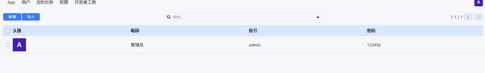

## form

**Form 视图** 是用于显示单条记录的详细信息的视图类型。它是 Avalon中最常用的视图之一，通常用于创建、编辑和查看记录的详细内容。通过 Form 视图，用户可以管理模型的所有字段，并定义交互式的用户界面。

记录保存在base.action.view模型中

```xml
 <record id="base_user_view_form" service="base.action.view">
        <field name="name">base_user_view_form</field>
        <field name="label">用户表单</field>
        <field name="viewMode">form</field>
        <field name="ref_serviceId">base.user</field>
        <field name="arch" type="xml">
            <form>
                <sheet>
                    <row>
                        <col>
                            <field name="name"/>
                            <field name="account"/>
                            <field name="password"/>
                        </col>
                        <col>
                            <field name="avatar"/>
                            <field name="debug"/>
                        </col>
                    </row>
                </sheet>
            </form>
        </field>
    </record>
```

例子

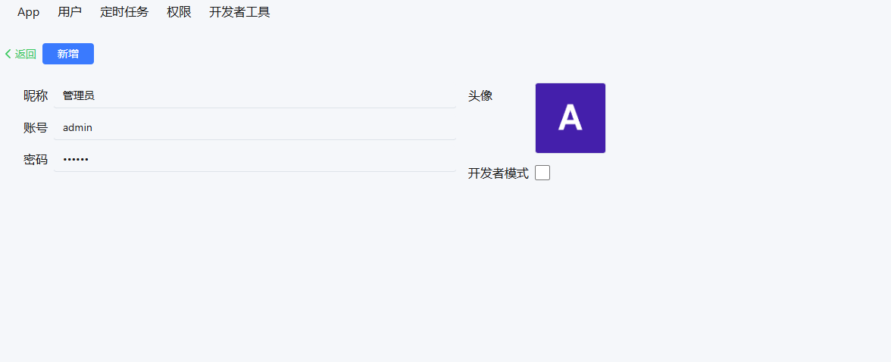

## kanban

**Kanban 视图** 是一种用于以卡片形式来显示模型记录的视图类型。Kanban 视图非常适合显示分组数据(没实现)，并允许用户通过拖拽(没实现)的方式管理记录的状态（或其他属性）

记录保存在base.action.view模型中，同时template标签之外的字段才可以使用

```XML
 <record id="base_module_view_kanban" service="base.action.view">
        <field name="name">kanban</field>
        <field name="label">看板</field>
        <field name="viewMode">kanban</field>
        <field name="ref_serviceId">base.module</field>
        <field name="arch" type="xml">
            <kanban>
                <field name="name"/>
                <field name="label"/>
                <field name="description"/>
                <field name="isInstall"/>
                <field name="icon"/>
                <field name="createTime"/>
                <template>
                    <div class="pr-4 flex justify-center items-center mr-4">
                        <MyImage width="50" height="50" :src="getModuleIcon(name,icon)"/>
                    </div>
                    <div class="pr-4">
                        <div>
                            <div class="pb-0.5">{{ label }}</div>
                            <div class="text-gray-400">{{ description }}</div>
                        </div>
                        <div class="pt-4">
                            <MyButton :rounded="true" type="primary" :action="isInstall ? 'upgrade':'install'"
                                      action-type="object">{{ isInstall ? '升级' : '安装' }}
                            </MyButton>
                            <MyButton :rounded="true" class="ml-2" type="danger" v-if="isInstall" action="uninstall"
                                      action-type="object">卸载
                            </MyButton>
                        </div>
                    </div>
                </template>
            </kanban>
        </field>
    </record>
```

例子

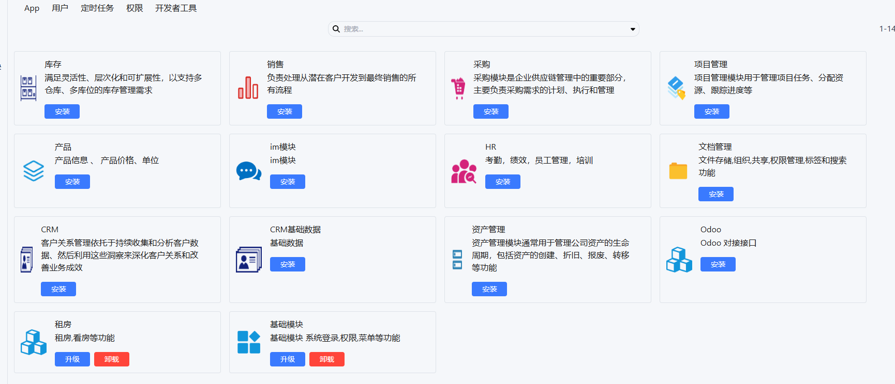

# 菜单

创建前端菜单入口,只能三级

## 创建模型窗口

```xml
<avalon>
    <menuitem id="menu_base_group_paren" name="权限">
        <menuitem id="menu_base_group_action" name="权限组" action="base_group_action"/>
        <menuitem id="menu_base_rule_action" name="记录规则" action="base_rule_action"/>
	</menuitem>
</avalon>
```

## 创建调用后台方法菜单

意图：点击之后 调用base.module模型下的refreshModuleFromDisk方法

```xml
<avalon>
	<menuitem id="menu_module_parent_action" name="App">
        <menuitem id="menu_module_refresh_action" serviceId="base.module" name="更新模块" type="object"
                  action="refreshModuleFromDisk"/>
    </menuitem>
</avalon>
```


# 在form视图的顶部创建按钮

按钮默认都是调用后台方法 调用document.show.transient模型的uploadFile方法，默认会带上当前id参数，如果是新增状态，则不传id参数

```xml
<record id="document_document_show_form" service="base.action.view">
        <field name="name">document show</field>
        <field name="label">文件</field>
        <field name="viewMode">form</field>
        <field name="ref_serviceId">document.show.transient</field>
        <field name="arch" type="xml">
            <form create="false" edit="false">
                <header>
                    <MyButton :rounded="true" type="primary" class="ml-2" action="uploadFile"
                              action-type="object">上传文件
                    </MyButton>
                </header>
                <sheet>
                    <field name="documents" widget="document"/>
                </sheet>
            </form>
        </field>
    </record>
```


# 调用前端方法

可以在调用后台方法时，返回指定格式的值，前端会根据情况进行前端调用

格式

```json
{
    "type":"ir.actions.client", // 命令类型
    "tag":"uploadDocument", // 方法
    "param":{} // 参数，没有可以不传
}
```

例子

```java
 // 上传文件,前端跳转路由
    public RecordRow uploadFile() {
        RecordRow row = RecordRow.build();
        row.put("type", "ir.actions.client")
                .put("tag", "uploadDocument");
        return row;
    }
```


# web

## Form表单属性

控制create,保存按钮隐藏

```xml
 <form create="false" edit="false">
     ...
</form>
```


## 视图继承

主要字段inheritId 设置被继承的资源id

资源id：模型名.{id}

### tree继承

```xml
   <record id="hr_user_view_tree" service="base.action.view">
        <field name="name">hr_user_view_tree</field>
        <field name="label">用户</field>
        <field name="viewMode">tree</field>
        <field name="inheritId" ref="base.base_user_view_tree"/>
        <field name="ref_serviceId">base.user</field>
        <field name="arch" type="xml">
            <xpath expr="//field[@name='name']" position="after">
                <field name="staffId"/>
            </xpath>
        </field>
    </record>
```

### form继承

```xml
    <record id="hr_user_view_form" service="base.action.view">
        <field name="name">base_user_view_form</field>
        <field name="label">用户表单</field>
        <field name="viewMode">form</field>
        <field name="ref_serviceId">base.user</field>
        <field name="inheritId" ref="base.base_user_view_form"/>
        <field name="arch" type="xml">
            <xpath expr="//row" position="after">
                <notebook>
                    <page label="基本信息">
                        <row>
                            <col>
                                <field name="staffId"/>
                            </col>
                        </row>
                    </page>
                </notebook>
            </xpath>
        </field>
    </record>
```

