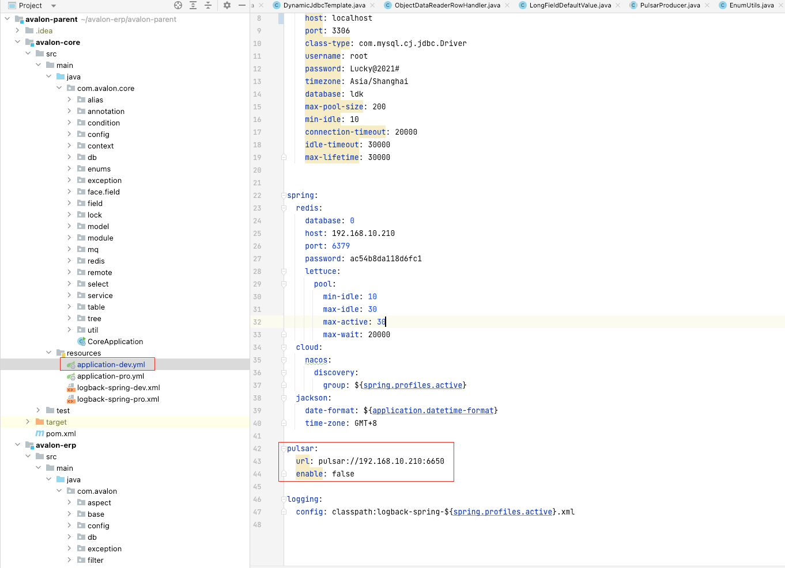
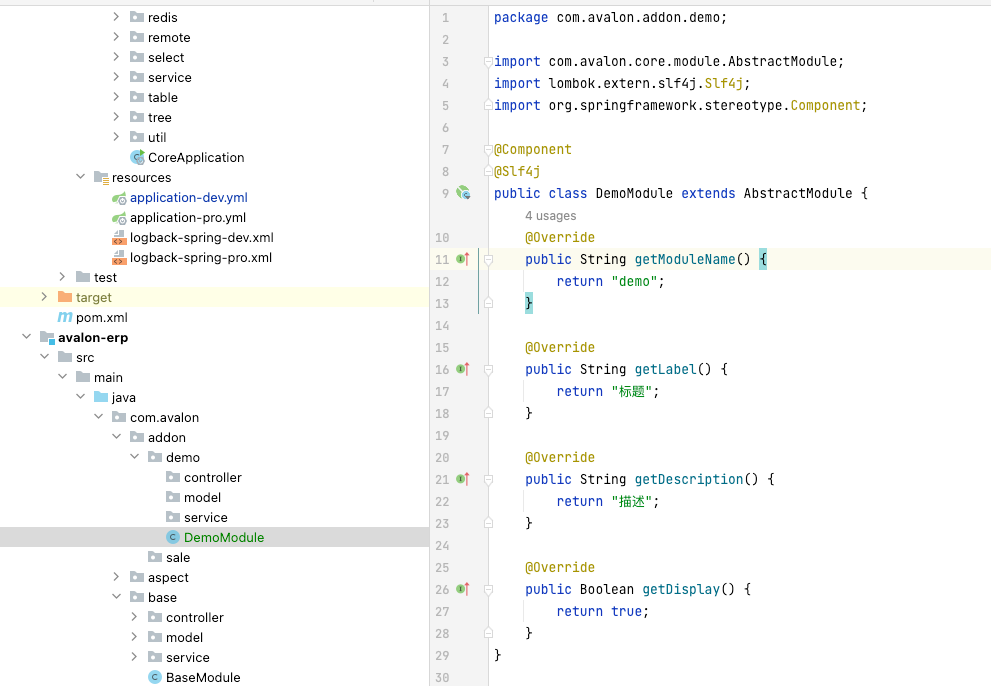
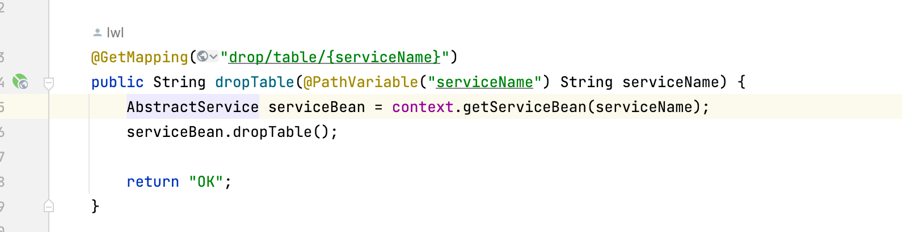

# avalon

## 介绍

demo: http://120.79.92.127/  账号 admin/123456

<!--创建数据库后，记得删除，保证大家的使用体验-->

后端erp快速开发框架,支持springcloud,自动创建数据库，自动关联表等功能

> 有需要帮助的地方，可以私加我微信liwenliang3623
>

## 安装教程

1.  jdk15+
2.  redis
3.  Nacos
4.  Pulsar 消息服务(可选)
5.  Mysql8+/Postgres15+

## 使用说明

1.  配置mysql数据库

****

2. 配置postgres数据库


3. 配置redis


4. 配置nacos


5. 配置Pulsar 可选 不启用 需要将 enable 设置为false 否则系统无法启动




## 支持的字段

1. 基本字段

```java
BigDecimal,BigInteger,Boolean,Date,DateTime,Double,Float,Html,Image,Integer,Selection(Enum),String,Text,Time
```

2. 关联字段

```java
One2one,One2many,Many2one,Many2many
```

## 模块的基础文件 

有controller控制层，service服务层，model数据层，同时有个需要继承AbstracModule的子类的模块类



controller层：模块提供对外的接口

service层：对应mysql表结果，一个service对应一个表

model层：用于实现特定功能的数据基础类

DemoModule：模块类用于记录当前所有的service，以及描述模块功能等作用


## service层

一个service表示一张表，每张表带自带自增主键字段id，name名称字段，creator创建者id，creatTime创建时间，updater更新人，updateTime更新时间

### 通用接口

#### 新增

```java
Object insert(RecordRow recordRow)
```

参数为：map 字段名，值

返回值：主键，目前只有IntegerField，BigIntegerField

#### 修改

```java
public Integer update(RecordRow recordRow) throws AvalonException 
```

参数为：map 字段名，值

返回值：是影响的行数

#### 删除

```java
public Integer delete(Object id) throws AvalonException
```

参数为：主键

返回值：是影响的行数

#### 获取一条记录

```java
public RecordRow selectOne(String fields, Object id) throws AvalonException
```

参数：fields，是字段列表 使用逗号隔开

参数：id 是主键

#### 分页获取

```java
public PageInfo selectPage(PageParam pageParam, String fields,
                           String order, Condition condition)
```

参数：

pageParam：分页参数

fields：字段列表

order：排序 比如  id desc，name

condition：条件

#### 获取全部

```java
public Record select(List<String> fields, Condition condition, String order)
```

参数：

fields：字段列表

order：排序 比如  id desc，name

condition：条件


## 统一接口


### HomeController

#### 登录

URL： /login 值需要自己添加到数据库中

参数
```json
{
    "username": "admin",
    "password": "123456"
}
```

返回值

```json
{
    "id": 1,//userId
    "token": "1c59edf9d93840e994e813329b5470db"
}
```


### serviceController

是服务层增删改查的统一入口

#### 新增

需要在POST头部增加token的值，来自登录接口的返回值token

/model/add


参数：

```java
private String serviceName;//服务名 demo.order
private Map<String, Object> value;//键值对
```

#### 更新

/model/update


参数：

```java
private String serviceName;//服务名 demo.order
private Map<String, Object> value;//键值对 内部需要包含 主键  否则会报错
```

#### 删除

/model/delete


参数：

```java
 private String serviceName;
 private Integer id;//主键
```

#### 获取一条记录

/model/get/detail


参数：

```java
 private String fields; // field,field field.field,field
 private String serviceName;
 private Integer id;//主键
```

#### 获取分页列表

/model/get/page/condition/object


参数:

```json
{
  page:{
    pageNum:1,//第几页
    pageSize:10//一页10条
  },
  fields:"字段列表，用逗号隔开",
  "order":"排序，可以为null",
  condition:[
    {
            "name": "id",
            "value": 1,
            "op": "Equal"
    }
  ]
}
```


### DatabaseController

数据库操作

#### 创建表

/db/create/table/{serviceName}


参数: 服务名

#### 删除表

/db/drop/table/{serviceName}



参数：服务名

#### 升级表

/db/update/table/{serviceName} 


## demo模块


### 第一步 创建demo.user.detail表


### 调用新增接口

/model/add

```json
{
    "serviceName": "demo.user.detail",
    "value": {
        "userId": 1,
        "age": 48,
        "weight": 62
    }
}
```

这里用不到name，可以重载needDefaultNameField方法，并且返回false，不会创建name字段

```java
@Service
public class UserDetailService extends AbstractService {
    @Override
    public String getServiceName() {
        return "demo.user.detail";
    }

    private final Field userId = Fields.createMany2one("用户","base.user");

    private final Field age = Fields.createInteger("年龄");
    private final Field weight = Fields.createFloat("体重");

    @Override
    public Boolean needDefaultNameField() {
        return false;
    }
}
```

数据库的结果为：


### 更新接口

url: /model/update

参数：

```json
{
    "serviceName":"demo.user.detail",
    "value":{
        "id":1,
        "age":20
    }
}
```

数据库结果值


### 分页获取接口

/model/get/page/condition/high

参数

```json
{
    "serviceName":"demo.user.detail",
    "fields":"id,age,weight,userId.account",
    "page":{
        "pageNum":1,
        "pageSize":10
    },
    "order":"id desc",
    "condition":[
        {
            "name":"userId.account",
            "value":"admin",
            "op":"Equal",
            "connector":"And"
        },
        {
            "name":"userId",
            "value":1,
            "op":"Equal"
        }
    ]

}
```

返回值：

```json
{
    "total": 1,
    "pageCur": 1,
    "pageSize": 10,
    "pageCount": 1,
    "nextPage": false,
    "prePage": false,
    "data": [
        {
            "userIdAccount": "admin",
            "weight": 62,
            "id": 1,
            "age": 20
        }
    ]
}
```

### 删除接口

url: /model/delete

参数

```json
{
    "serviceName":"demo.user.detail",
    "id":1
}
```

数据库结果


